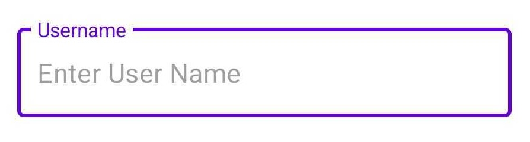
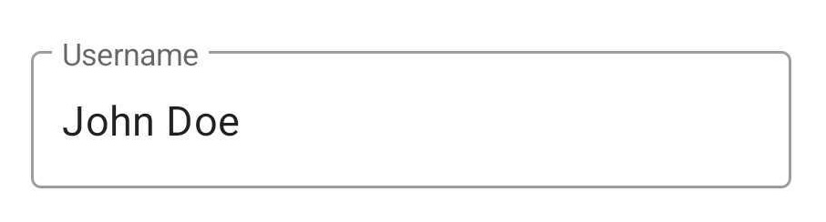
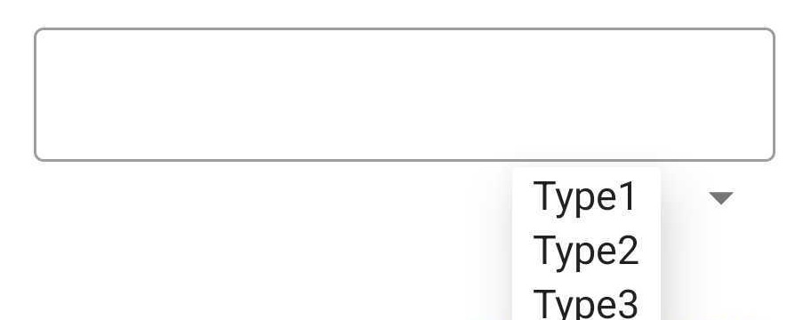
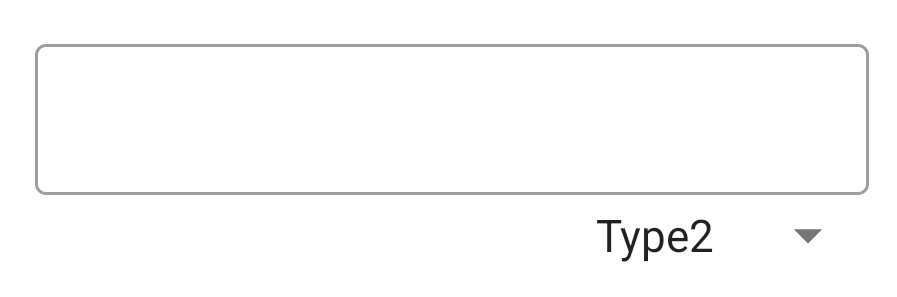

# Inputs Dialog

Why Inputs Dialog?

<i>Creating a dialog to accept inputs every time in Android isn't easy, and it's also a pain to specify the accessibility id every time you want to use the dialog for QA purposes...
Inputs Dialog makes these tasks much easier.</i>

## Installation

[](https://www.buymeacoffee.com/pokeumcho)

[](https://jitpack.io/#pokeum/qa-dialog/)

Add it in your root `build.gradle` at the end of repositories:

```gradle
allprojects {
  repositories {
    // ...
    maven { url 'https://jitpack.io' }
  }
}
```

Add the dependency

```gradle
implementation 'com.github.pokeum:qa-dialog:1.1.0'
```

## Usage

### Create Input Model

Here's how to configure the input fields that go inside the dialog.

#### Configure input fields

- Java

  > ```java
  > import co.pokeum.inputs.dialog.model.InputModelBuilder;
  > import co.pokeum.inputs.dialog.model.InputModelType;
  > 
  > new InputModelBuilder("{JSON_KEY}", InputModelType.KeyValue)
  >   // [BUILDER_ATTRIBUTES]
  >   .build();
  > ```

- Kotlin

  > ```kotlin
  > import co.pokeum.inputs.dialog.model.InputModelBuilder
  > import co.pokeum.inputs.dialog.model.InputModelType
  > 
  > InputModelBuilder("{JSON_KEY}", InputModelType.KeyValue)
  >   // [BUILDER_ATTRIBUTES]
  >   .build()
  > ```

#### Configure input fields with types

- Java

  > ```java
  > import co.pokeum.inputs.dialog.model.InputModelBuilder;
  > import co.pokeum.inputs.dialog.model.InputModelType;
  > 
  > new InputModelBuilder("{JSON_KEY}", InputModelType.KeyValueType)
  >   // [BUILDER_ATTRIBUTES]
  >   .build();
  > ```

- Kotlin

  > ```kotlin
  > import co.pokeum.inputs.dialog.model.InputModelBuilder
  > import co.pokeum.inputs.dialog.model.InputModelType
  > 
  > InputModelBuilder("{JSON_KEY}", InputModelType.KeyValueType)
  >   // [BUILDER_ATTRIBUTES]
  >   .build()
  > ```

#### Builder Attributes

<table style="border: 2px; width: auto;">
<tr><th> Attribute </th><th colspan="2"> Description </th><th> Example </th></tr>
<tr>
<td> 
      
**`setLabel`**(String text)

</td>  
<td colspan="2"> set label text </td>
<td>

"Username"


      
</td>
</tr>
<tr>
<td> 
      
**`hideLabel`**()

</td>  
<td colspan="2"> hide label </td>
<td>


</td>
</tr>
<tr>
<td> 
      
**`setValueContentDescription`**(String contentDescription)

</td>  
<td colspan="2"> set accessibility id for an edit text </td>
<td></td>
</tr>
<tr>
<td> 
      
**`setHint`**(String text)

</td>  
<td colspan="2"> set hint for an edit text </td>
<td>

"Enter User Name"



</td>
</tr>
<tr>
<td> 
      
**`setDefaultValue`**(String text)

</td>  
<td colspan="2"> set default value for an edit text </td>
<td>

"John Doe"



</td>
</tr>
<tr>
<td> 
      
**`setTypeContentDescription`**(String contentDescription)

</td>  
<td rowspan="3">Used only in configure input fields with types</td>
<td> set accessibility id for a dropdown menu </td>
<td></td>
</tr>
<tr>
<td> 
      
**`setTypeList`**(List<String> types)

</td>  
<td> set list of types for a dropdown menu </td>
<td>

["Type1", "Type2", "Type3"]


      
</td>
</tr>
<tr>
<td> 
      
**`setTypePosition`**(int position)

</td>  
<td> 
      
set the starting index (initial selection) for a dropdown menu (default is `0`)

</td>
<td>

`1` ("Type2")


      
</td>
</tr>
</table>

### Create Inputs Dialog

- Java
      
  > ```java
  > import co.pokeum.inputs.dialog.InputsDialog;
  > 
  > InputsDialog dialog = new InputsDialog.Builder(this)
  >   // [BUILDER_ATTRIBUTES]
  >   .build();
  > 
  > dialog.show();
  > ```

- Kotlin

  > ```kotlin
  > import co.pokeum.inputs.dialog.InputsDialog
  > 
  > val dialog = InputsDialog.Builder(this)
  >   // [BUILDER_ATTRIBUTES]
  >   .build()
  > 
  > dialog.show()
  > ```

#### Builder Attributes

| Attribute | Description |
| -- | -- |
| **`setTitle`**(String text) | set title of the dialog |
| **`setInputs`**(List<InputModel> inputs) | set list of [input models](#create-input-model) for the dialog |
| **`setListener`**(InputsDialogInterface.OnClickListener listener) | pass a [listener](#set-up-inputs-dialog-click-listener) to be called when the dialog button is clicked |
| **`setListenerId`**(int id) | pass a listener id to identify which dialog was interacted with if multiple dialogs are used |
| **`setPositiveButtonContentDescription`**(String contentDescription) | set accessibility id for a positive button (default is `"ok"`) |
| **`setPositiveButtonText`**(String text) | set positive button text (default is `"OK"`) |
| **`setNegativeButtonContentDescription`**(String contentDescription) | set accessibility id for a negative button (default is `"cancel"`) |
| **`setNegativeButtonText`**(String text) | set negative button text (default is `"Cancel"`) |

### Set up Inputs Dialog click listener

#### Click listener

- Java
      
  > ```java
  > import android.content.DialogInterface;
  > 
  > import androidx.annotation.NonNull;
  > 
  > import java.util.NoSuchElementException;
  > 
  > import co.pokeum.inputs.dialog.InputsDialogInterface;
  > import co.pokeum.inputs.dialog.model.ResultModel;
  > 
  > new InputsDialogInterface.OnClickListener() {
  > 
  >   @Override
  >   public void onPositiveButtonClick(DialogInterface dialog, int id, @NonNull String result) {
  >     // Handle the positive button click event.
  >     // Perform any actions required when the positive button is clicked.
  >     // For example, retrieve the input result from the dialog and process it.
  > 
  >     try {
  >       String inputValue = ResultModel.getValue(result, "{JSON_KEY}");
  >       int inputType = ResultModel.getType(result, "{JSON_KEY}");
  > 
  >     } catch (NoSuchElementException e) {
  >       // If the key does not exist or parsing fails.
  >     }
  > 
  >     dialog.dismiss();
  >   }
  > 
  >   @Override
  >   public void onNegativeButtonClick(DialogInterface dialog, int id) {
  >     // Handle the negative button click event.
  >     // Perform any actions required when the negative button is clicked.
  > 
  >     dialog.dismiss();
  >   }
  > };
  > ```

- Kotlin

  > ```kotlin
  > import android.content.DialogInterface
  > 
  > import co.pokeum.inputs.dialog.InputsDialogInterface
  > import co.pokeum.inputs.dialog.model.ResultModel
  > 
  > object : InputsDialogInterface.OnClickListener {
  > 
  >   override fun onPositiveButtonClick(dialog: DialogInterface?, id: Int, result: String) {
  >     // Handle the positive button click event.
  >     // Perform any actions required when the positive button is clicked.
  >     // For example, retrieve the input result from the dialog and process it.
  > 
  >     try {
  >       val inputValue: String = ResultModel.getValue(result, "{JSON_KEY}")
  >       val inputType: Int = ResultModel.getType(result, "{JSON_KEY}")
  > 
  >     } catch (e: NoSuchElementException) {
  >       // If the key does not exist or parsing fails.
  >     }
  > 
  >     dialog?.dismiss()
  >   }
  > 
  >   override fun onNegativeButtonClick(dialog: DialogInterface?, id: Int) {
  >     // Handle the negative button click event.
  >     // Perform any actions required when the negative button is clicked.
  > 
  >     dialog?.dismiss()
  >   }
  > }
  > ```

#### Result listener

- Java
      
  > ```java
  > import android.content.DialogInterface;
  > 
  > import androidx.annotation.NonNull;
  > 
  > import java.util.NoSuchElementException;
  > 
  > import co.pokeum.inputs.dialog.InputsDialogInterface;
  > import co.pokeum.inputs.dialog.model.ResultModel;
  > 
  > new InputsDialogInterface.ResultListener() {
  > 
  >   @Override
  >   public void onPositiveButtonClick(DialogInterface dialog, int id, @NonNull String result) {
  >     // Handle the positive button click event.
  >     // Perform any actions required when the positive button is clicked.
  >     // For example, retrieve the input result from the dialog and process it.
  > 
  >     try {
  >       String inputValue = ResultModel.getValue(result, "{JSON_KEY}");
  >       int inputType = ResultModel.getType(result, "{JSON_KEY}");
  > 
  >     } catch (NoSuchElementException e) {
  >       // If the key does not exist or parsing fails.
  >     }
  > 
  >     dialog.dismiss();
  >   }
  > };
  > ```

- Kotlin

  > ```kotlin
  > import android.content.DialogInterface
  > 
  > import co.pokeum.inputs.dialog.InputsDialogInterface
  > import co.pokeum.inputs.dialog.model.ResultModel
  > 
  > object : InputsDialogInterface.ResultListener {
  > 
  >   override fun onPositiveButtonClick(dialog: DialogInterface?, id: Int, result: String) {
  >     // Handle the positive button click event.
  >     // Perform any actions required when the positive button is clicked.
  >     // For example, retrieve the input result from the dialog and process it.
  > 
  >     try {
  >       val inputValue: String = ResultModel.getValue(result, "{JSON_KEY}")
  >       val inputType: Int = ResultModel.getType(result, "{JSON_KEY}")
  > 
  >     } catch (e: NoSuchElementException) {
  >       // If the key does not exist or parsing fails.
  >     }
  > 
  >     dialog?.dismiss()
  >   }
  > }
  > ```
